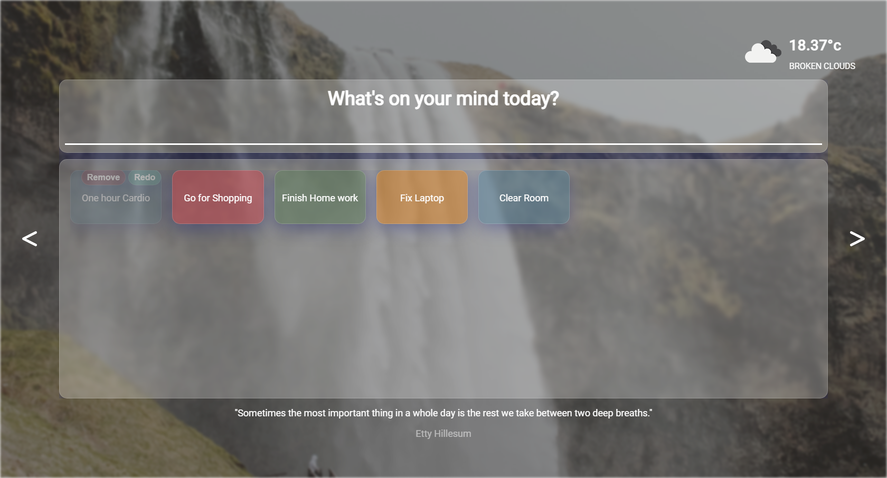

# React and Redux - Inspirational Home Page

This is a React-Redux application developed from scratch.

## Table of contents

- [Overview](#overview)
  - [The challenge](#the-challenge)
  - [Screenshot](#screenshot)
  - [Links](#links)
- [My process](#my-process)
  - [Built with](#built-with)
- [Acknowledgments](#acknowledgments)

## Overview

### Features

Users should be able to:

- See his city current weather and temperature
- See and change a background wallpaper
- See a random generated quote and its author
- Use the mini Todo application: Create new Todo, View all todos, mark a Todo as Completed, and remove todos.

### Screenshot

### Links

- Live Site URL: [live site URL here](https://inspirationalhomepageaymen.netlify.app)

## My process

### Built with

- Semantic HTML5 markup
- CSS custom properties
- Flexbox
- CSS Grid
- Responsive Design 
- Media queries
- React
- Redux
- quote API
- ipify API
- geo ipfy API
- openweathermap API
- unsplash API
- react-dom-confetti

## Author

- Linkedin - [Aymen Boudabia](https://linkedin.com/in/aymen-boudabia)
- Frontend Mentor - [@aymenfisher](https://www.frontendmentor.io/profile/aymenfisher)
- Github - [Aymen Boudabia](https://github.com/Aymenfisher)